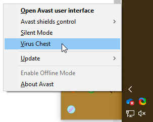
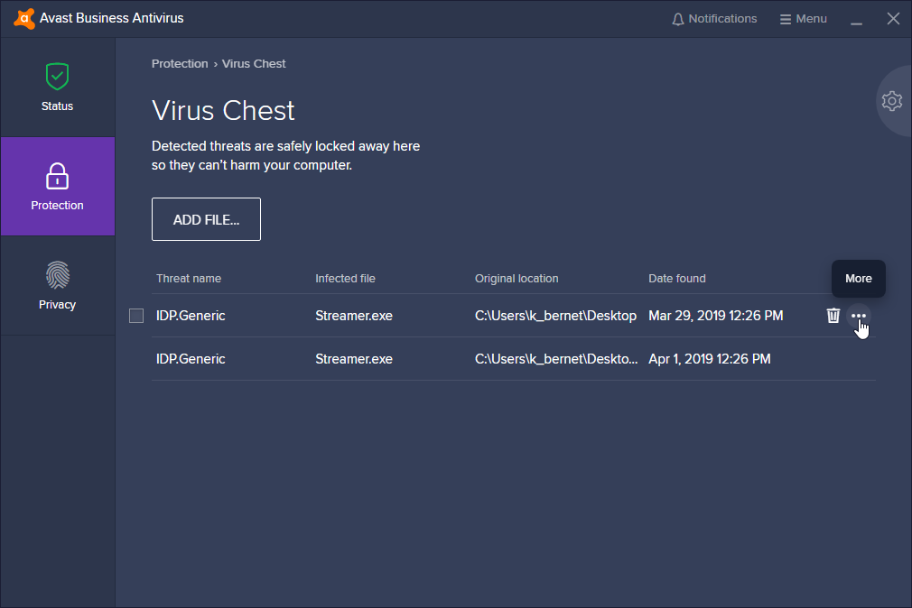
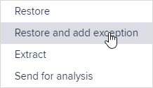
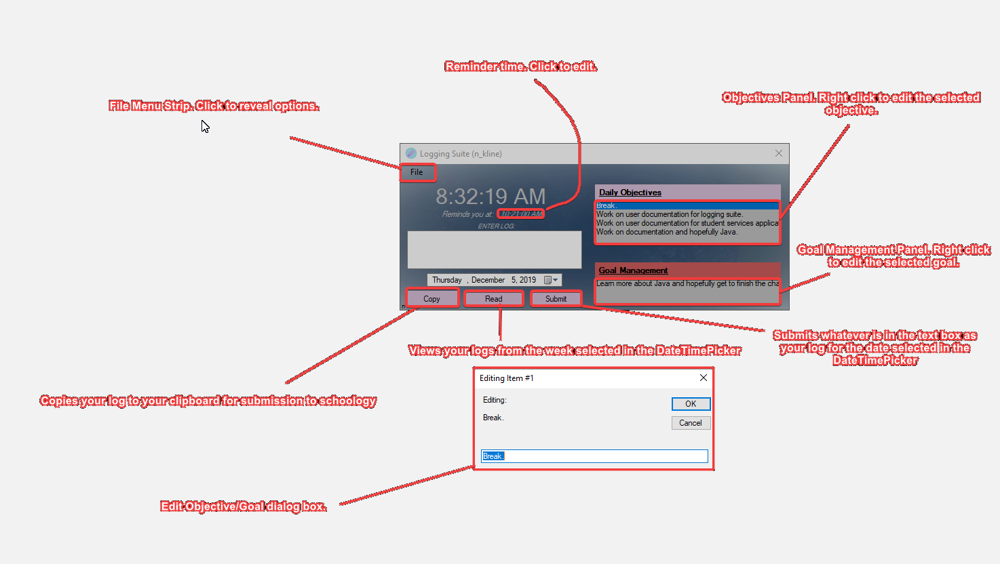

# ***ITP Logging Suite***
### *By: [Nick](http://steamcommunity.com/profiles/76561198124391666)*

## *Installation Instructions:*
1. Download the latest exe from [here](https://github.com/nicksuperiorservers/loggingSuite/releases/latest).
2. Run the program. If the program asks you for your goal in a little dialog input box, then it has ran successfully, if not, make an issue report on the github repository [here](https://github.com/nicksuperiorservers/loggingSuite/issues/new).  
2a. If Avast takes the executeable for [Interrogation](https://github.com/nicksuperiorservers/loggingSuite/blob/master/Images/Interro.png), press <b>More details</b> and Click on <b>I Trust This File</b>. After that, Press <b>Settings</b> then Click on the bubble that shows <b>"Allow me to decide"</b>. Finally, run the program again and click on More options in the Avast popup and click <b>Run Anyway</b>.

<h1> <b><i>General Information:</i></b> </h1>
- Everyday the program will launch when the computer starts. It also creates a Desktop shortcut. 
<h1> <b><i>Daily Objectives:</i></b> </h1>
- Whenever the program starts, it will ask for your objective for the day if you have not already entered it for the day.
- After entering your objective, it will add it to a listbox on the main form.
<h1> <b><i>Weekly Goal (Goal Management):</i></b> </h1>
- Along with the startup check for Daily Objectives, the program will also check to see if you entered a goal for the current week. If no goal is available for the week, the program will ask you to enter one. Program execution will not be available until goal is entered.
- After entering your goal, it will be available to be viewed on the main form in a listbox named "Goal Management".
<h1> <b><i>Reminder Time:</i></b> </h1>
- By clicking on the time that is underlined on the main form, it will show a SetTimeDialog so you can set the time the shutdown sequence will start.
<h1> <b><i>Shutdown Sequence/Reminder to do logs:</i></b> </h1>
- Whenever the time set by the user on the main form is equal to the machine's time, it will begin a *15 minute* shutdown sequence.
- The amount of minutes and seconds will be shown to the user on the main form until they press the *ABORT SHUTDOWN* button.
- More info will be provided here as time progresses.
<h1> <b><i>The Logging Suite & Avast:</i></b> </h1>
- Since avast is a very sensitive Anti-Virus, it will sometimes quarentine the .exe as a false positive. In order to add an exception for Avast, do the following:
  1) Expand the Windows Task Bar context menu to locate the avast icon and right click. Select the <b>Virus Chest</b> option. 
 
  2) In the virus chest menu, click on the 3 dots next to the application you wish to restore. 
   
  3) Click <b>Restore & Add Exception</b>. 
   
<h1> <b><i>Other Features:</i></b> </h1>

